# Splice Fungi

# Splicing Analysis on fungal RNASeq data

RNASeq data was generated for Cn cells treated with Cdk7 inhibitors.
SpliceWiz, R-package was implemented to process BAM files and further
analyse the splicing results.

### Install SpliceFungi

``` r
if(require("devtools")){
        options(repos = BiocManager::repositories())
        devtools::install_github("sethiyap/SpliceFungi",build = FALSE)
} else{
        options(repos = BiocManager::repositories())
        install.packages("devtools")
        devtools::install_github("sethiyap/SpliceFungi", build = FALSE)
}
```

### Process BAM files

Fastq files were aligned to ensembl genome using STAR aligner and were
generally processed with SpliceWiz as below.

``` r
ref_path <- "/Users/pooja/Documents/CDK7_project/SpliceFungi/Reference"


bam_path <- SpliceWiz::findBAMS(sample_path = "/Users/pooja/Documents/CDK7_project/RNASeq/RNASeq_5h/Mev_5h_ensembl/", level = 0)

pb_path=file.path("/Users/pooja/Documents/CDK7_project/SpliceFungi", "spliceWiz_Mev_5h")

SpliceWiz::processBAM(
    bamfiles = bam_path$path,
    sample_names = bam_path$sample,
    reference_path = ref_path,
    n_threads = 1,
    output_path = pb_path,
    run_featureCounts = T
)

# Load gene counts
gene_counts <- readRDS(file.path(pb_path, "main.FC.Rds"))

# Access gene counts:
gene_counts$counts
```

### Sample analysis

## WT+SY-1365 (1h)

Downstream processing of bam files

``` r
ref_path <- "/Users/pooja/Documents/CDK7_project/SpliceFungi/Reference"

pb_path_Mev_1h <- file.path("/Users/pooja/Documents/CDK7_project/SpliceFungi", "spliceWiz_process_1h_Mev/")

control = "WT_1h"

treatment = "WT_Mev_1h"

se_Mev_1h <- SpliceFungi::get_ASE(reference_path = ref_path, processed_bam_path = pb_path_Mev_1h, control = control, treatment = treatment, replicates = 3)
```


    |                                                 |condition |batch |
    |:------------------------------------------------|:---------|:-----|
    |WT_DMSO_Set1_star_alignAligned.sortedByCoord.out |WT_1h     |set1  |
    |WT_DMSO_Set2_star_alignAligned.sortedByCoord.out |WT_1h     |set2  |
    |WT_DMSO_Set3_star_alignAligned.sortedByCoord.out |WT_1h     |set3  |
    |WT_Mevo_Set1_star_alignAligned.sortedByCoord.out |WT_Mev_1h |set1  |
    |WT_Mevo_Set2_star_alignAligned.sortedByCoord.out |WT_Mev_1h |set2  |
    |WT_Mevo_Set3_star_alignAligned.sortedByCoord.out |WT_Mev_1h |set3  |

``` r
se.filtered_Mev_1h <- se_Mev_1h[SpliceWiz::applyFilters(se_Mev_1h),]

res_edgeR_Mev_1h <- SpliceFungi::get_DE_ASE(se_filtered_object =  se.filtered_Mev_1h, control = control, treatment = treatment, plot_volcano = FALSE)
```

    [1] "Only PSI plot"


``` r
raw_value_Mev_1h <- SummarizedExperiment::assay(se.filtered_Mev_1h, "Included") %>%
                tibble::as_tibble(rownames = NA)

# splicing stats

SpliceFungi::splicing_statistics(se_filtered_object = se.filtered_Mev_1h, res_edgeR = res_edgeR_Mev_1h)
```

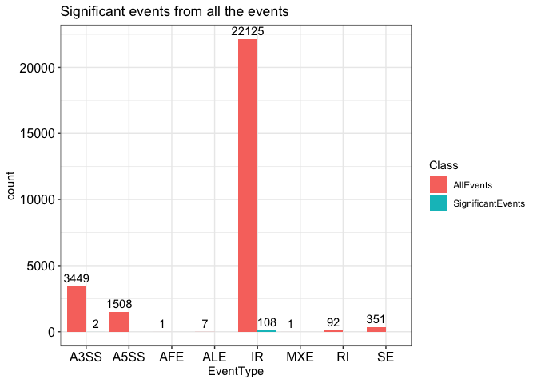

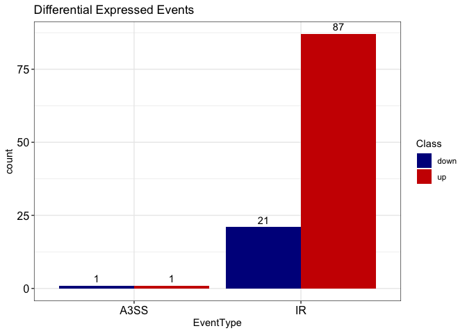

### ASE coverage plots

#### Intron Exclusion

``` r
event_list <- c("CNAG_03333/AFR96554_Intron1/clean", "CNAG_04112/AFR96843_Intron8/clean")

SpliceFungi::coverage_plot_for_list(event_list = event_list, res_edgeR = res_edgeR_Mev_1h, se_object = se_Mev_1h, control = "WT_1h",treatment = "WT_Mev_1h")
```

    [1] "CNAG_03333/AFR96554_Intron1/clean" "CNAG_04112/AFR96843_Intron8/clean"


#### Intron retention

``` r
event_list <- c("CNAG_00399/AFR92532_Intron6/clean", "CNAG_06032/AFR98271_Intron4/clean")

SpliceFungi::coverage_plot_for_list(event_list = event_list, res_edgeR = res_edgeR_Mev_1h, se_object = se_Mev_1h, control = "WT_1h",treatment = "WT_Mev_1h")
```

    [1] "CNAG_00399/AFR92532_Intron6/clean" "CNAG_06032/AFR98271_Intron4/clean"

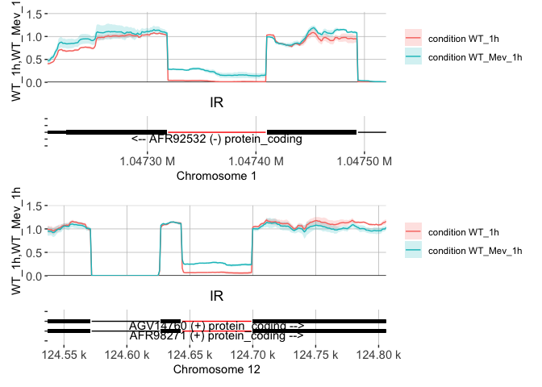

#### A3Ss

``` r
event_list <- c("A3SS:CNAG_00075-novelTr003-exon2;AFR92212-exon2", "A3SS:AFR95560-exon6;CNAG_07164-novelTr002-exon2")

SpliceFungi::coverage_plot_for_list(event_list = event_list, res_edgeR = res_edgeR_Mev_1h, se_object = se_Mev_1h, control = "WT_1h",treatment = "WT_Mev_1h")
```

    [1] "A3SS:CNAG_00075-novelTr003-exon2;AFR92212-exon2"
    [2] "A3SS:AFR95560-exon6;CNAG_07164-novelTr002-exon2"

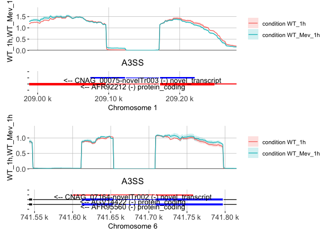

## WT+BS-181 (1h)


    |                                                               |condition |batch |
    |:--------------------------------------------------------------|:---------|:-----|
    |WT_1h_1_star_aligned_to_ensemblAligned.sortedByCoord.out       |WT_1h     |set1  |
    |WT_1h_2_star_aligned_to_ensemblAligned.sortedByCoord.out       |WT_1h     |set2  |
    |WT_1h_3_star_aligned_to_ensemblAligned.sortedByCoord.out       |WT_1h     |set3  |
    |WT_BS181_1h_1_star_aligned_to_ensemblAligned.sortedByCoord.out |WT_bs_1h  |set1  |
    |WT_BS181_1h_2_star_aligned_to_ensemblAligned.sortedByCoord.out |WT_bs_1h  |set2  |
    |WT_BS181_1h_3_star_aligned_to_ensemblAligned.sortedByCoord.out |WT_bs_1h  |set3  |

    [1] "Only PSI plot"

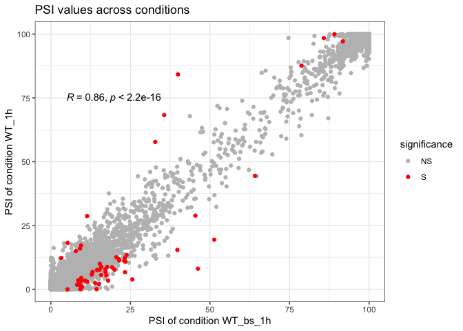

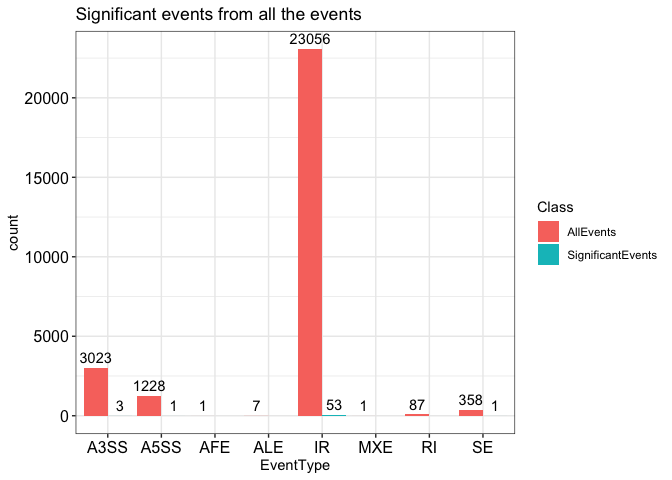

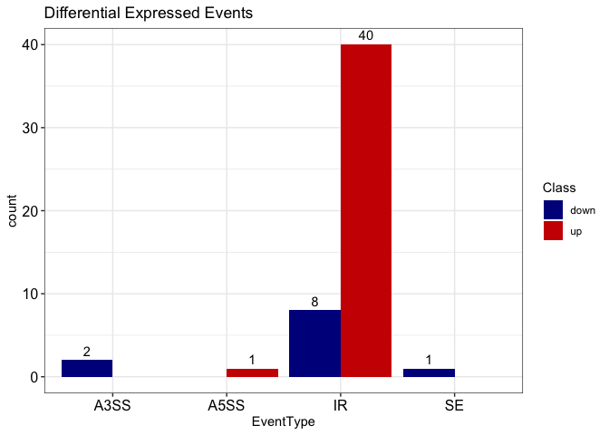

## WT+BS-181 (5h)

``` r
ref_path <- "/Users/pooja/Documents/CDK7_project/SpliceFungi/Reference"

pb_path_bs_5h <- file.path("/Users/pooja/Documents/CDK7_project/SpliceFungi", "spliceWiz_process_BS181_5h/")

control = "WT_5h"

treatment = "WT_bs_5h"

se_bs_5h <- SpliceFungi::get_ASE(reference_path = ref_path, processed_bam_path = pb_path_bs_5h, control = treatment, treatment = control, replicates = 3)
```


    |                                                                           |condition |batch |
    |:--------------------------------------------------------------------------|:---------|:-----|
    |WT_BS181_50ug_YPD_5h_set1_star_aligned_to_ensemblAligned.sortedByCoord.out |WT_bs_5h  |set1  |
    |WT_BS181_50ug_YPD_5h_set2_star_aligned_to_ensemblAligned.sortedByCoord.out |WT_bs_5h  |set2  |
    |WT_BS181_50ug_YPD_5h_set3_star_aligned_to_ensemblAligned.sortedByCoord.out |WT_bs_5h  |set3  |
    |WT_YPD_5h_set1_star_aligned_to_ensemblAligned.sortedByCoord.out            |WT_5h     |set1  |
    |WT_YPD_5h_set2_star_aligned_to_ensemblAligned.sortedByCoord.out            |WT_5h     |set2  |
    |WT_YPD_5h_set3_star_aligned_to_ensemblAligned.sortedByCoord.out            |WT_5h     |set3  |

``` r
se.filtered_bs_5h <- se_bs_5h[SpliceWiz::applyFilters(se_bs_5h),]

res_edgeR_bs_5h <- SpliceFungi::get_DE_ASE(se_filtered_object =  se.filtered_bs_5h, control = control, treatment = treatment, plot_volcano = FALSE) %>% 
  dplyr::mutate(class=dplyr::if_else(logFC >=1, "up", dplyr::if_else(logFC<= -1, "down", "no-change"))) %>% 
  dplyr::mutate(significance_FDR=dplyr::if_else(FDR< 0.05, "S","NS"),significance_PSI=dplyr::if_else(abs_deltaPSI>= 0.05, "S","NS"), 
                significance=dplyr::if_else(FDR < 0.05 & abs_deltaPSI>= 0.05, "S", "NS"))
```

    [1] "Only PSI plot"

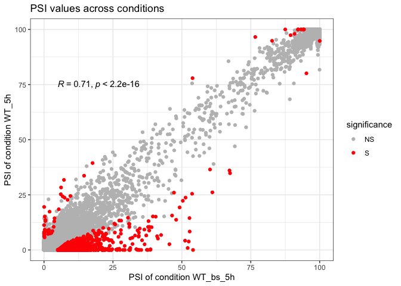

``` r
# All events Vs signficant events 
AS_tt <- res_edgeR_bs_5h %>% 
          dplyr::select(EventName, EventType, significance) %>% 
          dplyr::group_by(EventType) %>% 
          dplyr::tally()

deg_tt <- res_edgeR_bs_5h %>% 
          dplyr::select(EventName, EventType, significance_FDR) %>%
          dplyr::filter(significance_FDR=="S") %>%
          dplyr::group_by(EventType) %>% 
          dplyr::count()

se_stats <- AS_tt %>% 
          dplyr::left_join(deg_tt,by="EventType") 

ggplot2::ggplot(res_edgeR_bs_5h,
        ggplot2::aes(x = logFC, y = -log10(FDR), color=significance_FDR)) +         
        ggplot2::geom_point()  +
        ggplot2::scale_color_manual(values=c("grey", "red"))+
        ggplot2::labs(title = "Differential analysis - BS181 vs WT (5h)",
         x = "Log2-fold change", y = "FDR (-log10)")+ggplot2::theme_bw()+
        ggplot2::theme(axis.text = ggplot2::element_text(size=12, color="black"))
```

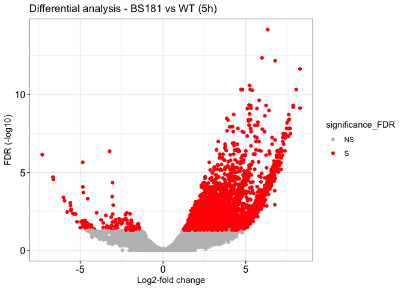

``` r
raw_value_bs_5h <- SummarizedExperiment::assay(se.filtered_bs_5h, "Included") %>% tibble::as_tibble(rownames = NA)
```

#### Splicing Stats BS_181 5h

``` r
SpliceFungi::splicing_statistics(se_filtered_object = se.filtered_bs_5h, res_edgeR = res_edgeR_bs_5h)
```

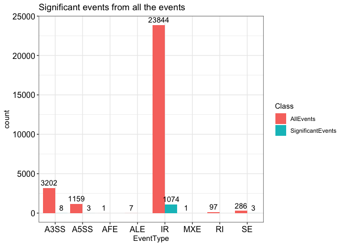


#### IR events

``` r
event_list=c("CNAG_03645/AFR93150_Intron1/clean", "CNAG_01232/AFR94914_Intron6/clean", "CNAG_02944/AFR93748_Intron1/clean" )

SpliceFungi::coverage_plot_for_list(event_list = event_list, res_edgeR = res_edgeR_bs_5h, se_object = se_bs_5h, control = "WT_5h",treatment = "WT_bs_5h")
```

    [1] "CNAG_03645/AFR93150_Intron1/clean" "CNAG_02944/AFR93748_Intron1/clean"
    [3] "CNAG_01232/AFR94914_Intron6/clean"

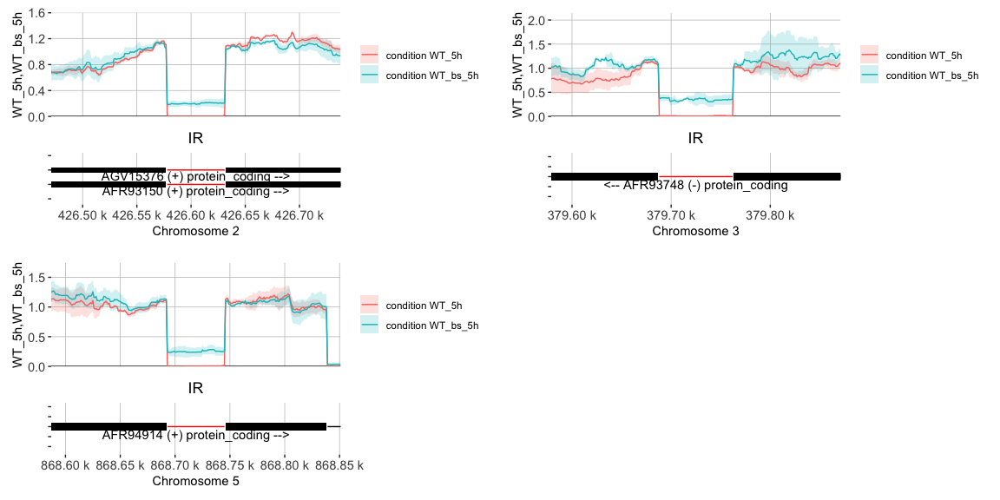

#### GO analysis on IR events at 5h post BS-181 treatment

``` r
go_dt <- readr::read_delim("BS181_5h_IR_genes.txt", delim="\t", col_names = TRUE)

#install.packages("../../CnCAKfunctions/org.CneoformansH99v64.eg.db")

library(org.CneoformansH99v64.eg.db)

ego <- clusterProfiler::enrichGO(gene = go_dt$EventName,
                                 OrgDb         = org.CneoformansH99v64.eg.db,
                                 ont           = "BP",
                                 keyType = "GID",
                                 pAdjustMethod = "none",
                                 pvalueCutoff  = 0.05,
                                 qvalueCutoff  = 1,
                                 readable      = TRUE, pool = FALSE)

cc <- clusterProfiler::gofilter(ego, level = 5)

go_filtered <- readr::read_delim("BS181_5h_ClusterProfilerGO.txt", delim="\t", col_names = T)

go_filtered %>% dplyr::mutate(GeneRatio=(as.numeric(count) / as.numeric(bg)), Description=forcats::as_factor(Description)) %>%
  ggplot2::ggplot(ggplot2::aes( Description,GeneRatio, color=-log10(pvalue)))+
  ggplot2::geom_segment(ggplot2::aes(x=Description, xend=Description, y=0, yend=GeneRatio), lwd=1)+
  ggplot2::geom_point(ggplot2::aes(size=as.numeric(count)))+
  ggplot2::coord_flip()+
  ggplot2::scale_color_gradient(low="#fd8d3c", high = "#b30000")+
  ggplot2::theme_bw()
```


